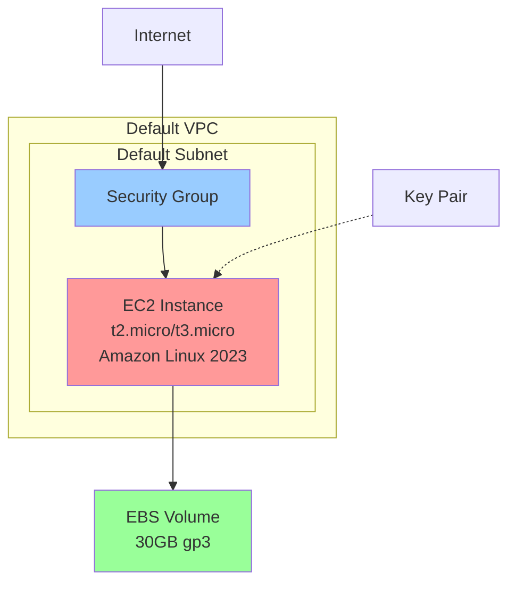

# Design Document: Simple EC2 Deployment

## Overview

This design provides a straightforward OpenTofu configuration for deploying a single EC2 instance within AWS free tier limits. The solution emphasizes simplicity, cost-effectiveness, and security best practices while maintaining infrastructure as code principles.

The deployment creates a minimal but functional cloud server suitable for development, testing, or learning purposes. All resources are configured to stay within AWS free tier limits to avoid unexpected charges.

## Architecture

The architecture follows a simple single-instance deployment pattern:



**Key Design Decisions:**

1. **Default VPC Usage**: Leverages AWS default VPC to minimize configuration complexity and avoid additional networking costs
2. **Free Tier Optimization**: All resources selected specifically for free tier eligibility
3. **Security-First Approach**: Custom security group with minimal required access
4. **Modular Configuration**: Separated into logical files for maintainability

## Components and Interfaces

### Core Infrastructure Components

**EC2 Instance**
- **Type**: t2.micro (primary) or t3.micro (fallback)
- **AMI**: Latest Amazon Linux 2023 (automatically resolved)
- **Storage**: 10GB General Purpose SSD (gp3) - maximum free tier allowance
- **Network**: Default VPC and subnet for simplicity
- **Public IP**: Automatically assigned for external access

**Security Group**
- **SSH Access**: Port 22 from 0.0.0.0/0 (configurable)
- **HTTP Access**: Port 80 from 0.0.0.0/0
- **HTTPS Access**: Port 443 from 0.0.0.0/0
- **Default Deny**: All other inbound traffic blocked
- **Outbound**: All traffic allowed (AWS default)

**Key Pair Management**
- **Creation**: New key pair generated if not exists
- **Naming**: Consistent with resource naming convention
- **Output**: Key pair name provided for reference

### Configuration Structure

**File Organization:**
```
simple-ec2-deployment/
├── main.tf           # Core resource definitions
├── variables.tf      # Input variables and defaults
├── outputs.tf        # Output values
├── versions.tf       # Provider version constraints
└── terraform.tfvars.example  # Example variable values
```

**Variable Interface:**
- `aws_region`: Target AWS region (default: us-east-1)
- `instance_type`: EC2 instance type (default: t2.micro)
- `key_pair_name`: SSH key pair name (default: generated)
- `allowed_ssh_cidr`: SSH access CIDR (default: 0.0.0.0/0)
- `project_name`: Resource naming prefix (default: simple-ec2)

## Data Models

### Resource Naming Convention
All resources follow a consistent naming pattern:
```
{project_name}-{resource_type}-{environment}
```

Example: `simple-ec2-instance-dev`, `simple-ec2-sg-dev`

### Tagging Strategy
Standard tags applied to all resources:
```hcl
tags = {
  Name        = "${var.project_name}-${resource_type}"
  Project     = var.project_name
  Environment = "development"
  ManagedBy   = "opentofu"
  Purpose     = "learning-development"
}
```

### AMI Data Source
Dynamic AMI resolution ensures latest Amazon Linux 2023:
```hcl
data "aws_ami" "amazon_linux" {
  most_recent = true
  owners      = ["amazon"]
  
  filter {
    name   = "name"
    values = ["al2023-ami-*-x86_64"]
  }
  
  filter {
    name   = "virtualization-type"
    values = ["hvm"]
  }
}
```

## Correctness Properties

*A property is a characteristic or behavior that should hold true across all valid executions of a system-essentially, a formal statement about what the system should do. Properties serve as the bridge between human-readable specifications and machine-verifiable correctness guarantees.*

Now I need to analyze the acceptance criteria to determine which ones can be tested as properties:

### Property 1: Instance Deployment Compliance
*For any* OpenTofu configuration deployment, the created EC2 instance should exist in the specified region, be in running state, have a public IP address, and be placed in the default VPC and subnet.
**Validates: Requirements 1.1, 1.4, 1.5, 2.4**

### Property 2: Free Tier Instance Type Compliance  
*For any* EC2 instance created by the configuration, the instance type should be either t2.micro or t3.micro to ensure free tier eligibility.
**Validates: Requirements 1.2, 4.1**

### Property 3: Amazon Linux 2023 AMI Usage
*For any* EC2 instance created by the configuration, the AMI should be the latest Amazon Linux 2023 AMI to ensure free tier eligibility and security updates.
**Validates: Requirements 1.3, 4.2**

### Property 4: Security Group Configuration Compliance
*For any* security group created by the configuration, it should allow SSH (port 22), HTTP (port 80), and HTTPS (port 443) from 0.0.0.0/0, and should not allow any other inbound traffic.
**Validates: Requirements 2.1, 2.2, 2.3, 2.5**

### Property 5: Key Pair Management
*For any* deployment, a key pair should exist and be associated with the EC2 instance, and if a key pair with the same name already exists, it should be reused without error.
**Validates: Requirements 3.1, 3.4**

### Property 6: Storage Configuration Compliance
*For any* EC2 instance created by the configuration, the root volume should use gp3 storage type with a maximum size of 30GB to stay within free tier limits.
**Validates: Requirements 4.3**

### Property 7: Resource Tagging and Naming Consistency
*For any* resources created by the configuration, they should have consistent naming conventions and include required tags for cost tracking and resource identification.
**Validates: Requirements 4.4, 5.4**

### Property 8: Minimal Resource Creation
*For any* deployment, only the essential resources (EC2 instance, security group, key pair) should be created to avoid additional charges beyond free tier limits.
**Validates: Requirements 4.5**

### Property 9: Required Output Availability
*For any* successful deployment, the OpenTofu outputs should include the instance ID, public IP address, and key pair name for user reference.
**Validates: Requirements 3.2, 3.5, 5.3**

## Error Handling

### Infrastructure Provisioning Errors

**AMI Resolution Failures**
- **Scenario**: Latest Amazon Linux 2023 AMI not found in region
- **Handling**: Configuration fails with descriptive error message
- **Recovery**: User must verify region supports Amazon Linux 2023 or select different region

**Instance Launch Failures**
- **Scenario**: t2.micro not available in region or account limits exceeded
- **Handling**: Automatic fallback to t3.micro if configured
- **Recovery**: Clear error messages guide user to check account limits or region availability

**Key Pair Conflicts**
- **Scenario**: Key pair name collision with different key
- **Handling**: Use existing key pair if name matches, fail if fingerprint differs
- **Recovery**: User can specify different key pair name or delete conflicting key

### Network Configuration Errors

**VPC/Subnet Issues**
- **Scenario**: Default VPC not available in region
- **Handling**: Configuration fails with guidance to create default VPC
- **Recovery**: User runs `aws ec2 create-default-vpc` or specifies custom VPC

**Security Group Rule Conflicts**
- **Scenario**: Security group rules conflict with existing rules
- **Handling**: OpenTofu manages rules declaratively, removing conflicts
- **Recovery**: Manual intervention only if external dependencies exist

### Cost and Compliance Errors

**Free Tier Violations**
- **Scenario**: Configuration attempts to use non-free-tier resources
- **Handling**: Variable validation prevents invalid instance types
- **Recovery**: Configuration fails fast with clear guidance

**Resource Limit Exceeded**
- **Scenario**: AWS account limits prevent resource creation
- **Handling**: AWS API returns descriptive error messages
- **Recovery**: User must request limit increases or clean up existing resources

## Testing Strategy

### Dual Testing Approach

This feature requires both unit tests and property-based tests to ensure comprehensive coverage:

**Unit Tests** verify specific examples and edge cases:
- Specific AMI ID resolution for known regions
- Security group rule formatting and validation
- Variable validation with known good/bad values
- Output formatting and structure
- Error handling for common failure scenarios

**Property-Based Tests** verify universal properties across all inputs:
- Instance deployment compliance across different regions
- Free tier compliance across different configurations
- Security group rules consistency across different CIDR inputs
- Resource tagging consistency across different naming patterns
- Output completeness across different deployment scenarios

### Property-Based Testing Configuration

**Testing Framework**: [Terratest](https://terratest.gruntwork.io/) with Go for infrastructure testing
**Test Iterations**: Minimum 100 iterations per property test to ensure comprehensive coverage
**Test Environment**: Isolated AWS account or sandbox environment to avoid conflicts

**Property Test Annotations**:
Each property-based test must include a comment referencing its design document property:
```go
// Feature: simple-ec2-deployment, Property 1: Instance Deployment Compliance
func TestInstanceDeploymentCompliance(t *testing.T) { ... }
```

**Test Data Generation**:
- **Regions**: Generate tests across multiple AWS regions
- **Instance Types**: Test both t2.micro and t3.micro configurations  
- **Naming Patterns**: Generate various valid project names and resource names
- **CIDR Blocks**: Test different valid CIDR ranges for SSH access
- **Tag Combinations**: Test various tag key-value combinations

### Integration Testing

**End-to-End Deployment Tests**:
- Full deployment and teardown cycles
- Cross-region deployment validation
- Resource dependency verification
- Cost estimation validation

**Idempotency Testing**:
- Multiple `tofu apply` operations should not change infrastructure
- Key pair reuse scenarios
- Configuration drift detection and correction

### Test Execution Strategy

**Automated Testing Pipeline**:
1. **Validation Phase**: Variable validation and configuration syntax checking
2. **Plan Phase**: `tofu plan` execution and output verification
3. **Apply Phase**: Resource creation and property validation
4. **Verify Phase**: AWS API queries to confirm resource states
5. **Destroy Phase**: Clean teardown and resource cleanup verification

**Test Isolation**:
- Each test uses unique resource names to avoid conflicts
- Parallel test execution with separate AWS regions
- Automatic cleanup on test completion or failure

**Performance Considerations**:
- Tests run against real AWS infrastructure (not mocked)
- Test execution time balanced against comprehensive coverage
- Resource creation/destruction optimized for cost efficiency