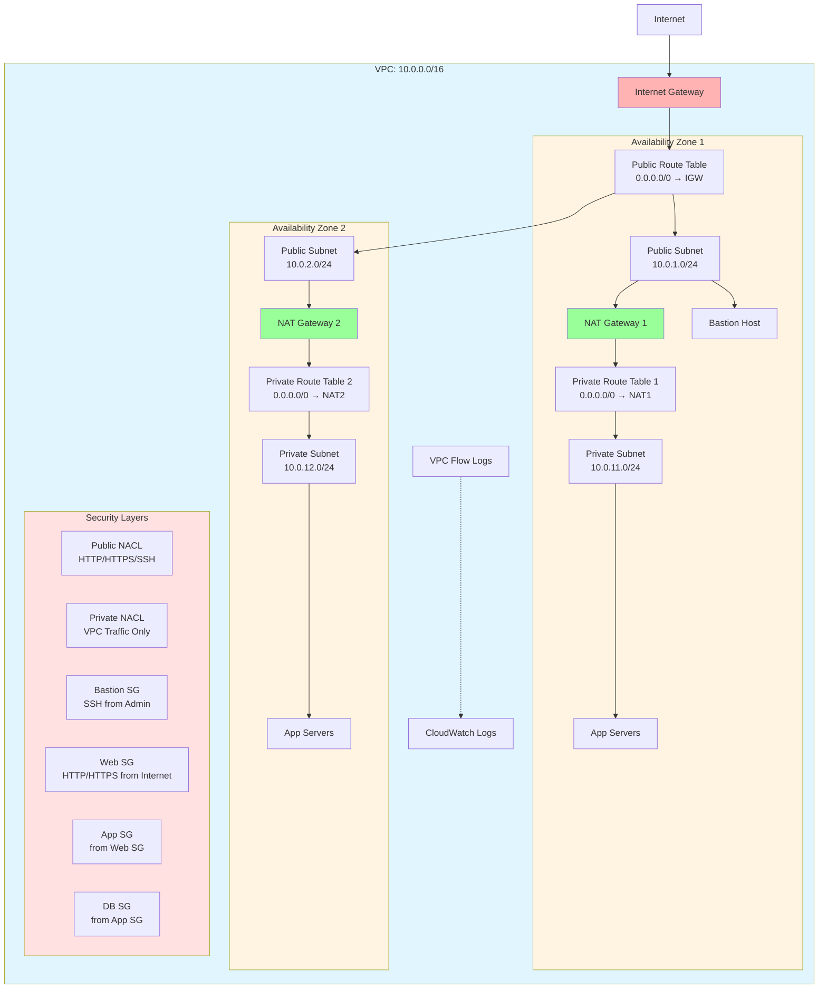

# Design Document: VPC Best Practices Deployment

## Overview

This design provides a production-ready VPC implementation following AWS Well-Architected Framework principles. The solution implements a multi-AZ architecture with proper network segmentation, defense-in-depth security, high availability, and comprehensive monitoring.

Unlike the simple-ec2-deployment which uses the default VPC, this solution creates a custom VPC from scratch with enterprise-grade networking and security controls suitable for production workloads.

## Architecture

The architecture follows AWS best practices for network design:



**Key Design Decisions:**

1. **Custom VPC**: Complete control over network configuration and security
2. **Multi-AZ Design**: Resources distributed across 2 AZs for high availability
3. **Network Segmentation**: Clear separation between public and private subnets
4. **Redundant NAT**: One NAT Gateway per AZ for fault tolerance (configurable for cost)
5. **Defense-in-Depth**: Multiple security layers (NACLs + Security Groups)
6. **Monitoring**: VPC Flow Logs enabled for traffic analysis
7. **Scalable CIDR**: /16 VPC with /24 subnets allows for expansion

## Components and Interfaces

### Network Foundation

**VPC Configuration**
- **CIDR Block**: 10.0.0.0/16 (65,536 IP addresses)
- **DNS Hostnames**: Enabled for resource name resolution
- **DNS Support**: Enabled for Route53 integration
- **Tenancy**: Default (shared hardware for cost efficiency)
- **IPv6**: Optional (can be enabled via variable)

**Subnet Layout**
```
Public Subnets (Internet-facing resources):
  - AZ1: 10.0.1.0/24  (256 IPs, ~251 usable)
  - AZ2: 10.0.2.0/24  (256 IPs, ~251 usable)

Private Subnets (Backend resources):
  - AZ1: 10.0.11.0/24 (256 IPs, ~251 usable)
  - AZ2: 10.0.12.0/24 (256 IPs, ~251 usable)

Reserved for future expansion:
  - 10.0.3.0/24 - 10.0.10.0/24 (Public)
  - 10.0.13.0/24 - 10.0.255.0/24 (Private)
```

### Internet Connectivity

**Internet Gateway**
- Single IGW attached to VPC
- Provides internet access for public subnets
- Managed by AWS (no maintenance required)
- No bandwidth constraints

**NAT Gateway Strategy**
```hcl
# High Availability (Production)
nat_gateway_strategy = "per_az"
# Creates NAT Gateway in each AZ
# Cost: ~$32/month per NAT Gateway

# Cost Optimized (Dev/Test)
nat_gateway_strategy = "single"
# Creates single NAT Gateway in one AZ
# Cost: ~$32/month total
# Note: AZ failure affects all private subnets
```

**Elastic IP Addresses**
- One EIP per NAT Gateway
- Static public IPs for outbound traffic
- Enables IP whitelisting for external services

### Routing Architecture

**Public Route Table**
```hcl
destination_cidr_block = "0.0.0.0/0"
gateway_id            = aws_internet_gateway.main.id

# Associated with: Public Subnets in all AZs
```

**Private Route Tables**
```hcl
# Separate route table per AZ for NAT redundancy
AZ1 Private Route:
  destination_cidr_block = "0.0.0.0/0"
  nat_gateway_id        = aws_nat_gateway.az1.id

AZ2 Private Route:
  destination_cidr_block = "0.0.0.0/0"
  nat_gateway_id        = aws_nat_gateway.az2.id
```

### Network Access Control Lists (NACLs)

**Public NACL Rules**
```hcl
Inbound:
  100: HTTP (80) from 0.0.0.0/0         - ALLOW
  110: HTTPS (443) from 0.0.0.0/0       - ALLOW
  120: SSH (22) from 0.0.0.0/0          - ALLOW
  130: Ephemeral (1024-65535) from 0.0.0.0/0 - ALLOW
  *:   All other traffic                - DENY (implicit)

Outbound:
  100: HTTP (80) to 0.0.0.0/0           - ALLOW
  110: HTTPS (443) to 0.0.0.0/0         - ALLOW
  120: Ephemeral (1024-65535) to 0.0.0.0/0   - ALLOW
  *:   All other traffic                - DENY (implicit)
```

**Private NACL Rules**
```hcl
Inbound:
  100: All traffic from VPC CIDR        - ALLOW
  110: Ephemeral (1024-65535) from 0.0.0.0/0 - ALLOW (for responses)
  *:   All other traffic                - DENY (implicit)

Outbound:
  100: All traffic to VPC CIDR          - ALLOW
  110: HTTP (80) to 0.0.0.0/0           - ALLOW (for updates)
  120: HTTPS (443) to 0.0.0.0/0         - ALLOW (for updates)
  *:   All other traffic                - DENY (implicit)
```

### Security Group Architecture

**Layered Security Group Design**

```hcl
# Layer 1: Bastion/Jump Host
resource "aws_security_group" "bastion" {
  name_prefix = "${var.project_name}-bastion-"
  description = "Security group for bastion/jump hosts"
  
  ingress {
    description = "SSH from admin networks"
    from_port   = 22
    to_port     = 22
    protocol    = "tcp"
    cidr_blocks = var.admin_cidr_blocks
  }
  
  egress {
    description     = "SSH to private instances"
    from_port       = 22
    to_port         = 22
    protocol        = "tcp"
    security_groups = [aws_security_group.application.id]
  }
}

# Layer 2: Web/Load Balancer Tier
resource "aws_security_group" "web" {
  name_prefix = "${var.project_name}-web-"
  description = "Security group for web servers/load balancers"
  
  ingress {
    description = "HTTP from internet"
    from_port   = 80
    to_port     = 80
    protocol    = "tcp"
    cidr_blocks = ["0.0.0.0/0"]
  }
  
  ingress {
    description = "HTTPS from internet"
    from_port   = 443
    to_port     = 443
    protocol    = "tcp"
    cidr_blocks = ["0.0.0.0/0"]
  }
  
  egress {
    description     = "To application tier"
    from_port       = 8080
    to_port         = 8080
    protocol        = "tcp"
    security_groups = [aws_security_group.application.id]
  }
}

# Layer 3: Application Tier
resource "aws_security_group" "application" {
  name_prefix = "${var.project_name}-app-"
  description = "Security group for application servers"
  
  ingress {
    description     = "App port from web tier"
    from_port       = 8080
    to_port         = 8080
    protocol        = "tcp"
    security_groups = [aws_security_group.web.id]
  }
  
  ingress {
    description     = "SSH from bastion"
    from_port       = 22
    to_port         = 22
    protocol        = "tcp"
    security_groups = [aws_security_group.bastion.id]
  }
  
  egress {
    description     = "To database tier"
    from_port       = 3306
    to_port         = 3306
    protocol        = "tcp"
    security_groups = [aws_security_group.database.id]
  }
  
  egress {
    description = "HTTPS for external APIs"
    from_port   = 443
    to_port     = 443
    protocol    = "tcp"
    cidr_blocks = ["0.0.0.0/0"]
  }
}

# Layer 4: Database Tier
resource "aws_security_group" "database" {
  name_prefix = "${var.project_name}-db-"
  description = "Security group for database servers"
  
  ingress {
    description     = "MySQL from application tier"
    from_port       = 3306
    to_port         = 3306
    protocol        = "tcp"
    security_groups = [aws_security_group.application.id]
  }
  
  # No egress rules - database shouldn't initiate outbound connections
}
```

### VPC Flow Logs

**Configuration**
```hcl
resource "aws_flow_log" "main" {
  vpc_id          = aws_vpc.main.id
  traffic_type    = "ALL"  # ACCEPT, REJECT, or ALL
  iam_role_arn    = aws_iam_role.flow_logs.arn
  log_destination = aws_cloudwatch_log_group.flow_logs.arn
  
  tags = merge(
    local.common_tags,
    {
      Name = "${var.project_name}-vpc-flow-logs"
    }
  )
}
```

**IAM Role and Policy**
```hcl
resource "aws_iam_role" "flow_logs" {
  name_prefix = "${var.project_name}-flow-logs-"
  
  assume_role_policy = jsonencode({
    Version = "2012-10-17"
    Statement = [{
      Action = "sts:AssumeRole"
      Effect = "Allow"
      Principal = {
        Service = "vpc-flow-logs.amazonaws.com"
      }
    }]
  })
}

resource "aws_iam_role_policy" "flow_logs" {
  role = aws_iam_role.flow_logs.id
  
  policy = jsonencode({
    Version = "2012-10-17"
    Statement = [{
      Action = [
        "logs:CreateLogGroup",
        "logs:CreateLogStream",
        "logs:PutLogEvents",
        "logs:DescribeLogGroups",
        "logs:DescribeLogStreams"
      ]
      Effect   = "Allow"
      Resource = "*"
    }]
  })
}
```

## Data Models

### Variable Structure

```hcl
variable "vpc_cidr" {
  description = "CIDR block for VPC"
  type        = string
  default     = "10.0.0.0/16"
  
  validation {
    condition     = can(cidrhost(var.vpc_cidr, 0))
    error_message = "VPC CIDR must be a valid IPv4 CIDR block."
  }
}

variable "availability_zones" {
  description = "List of availability zones (leave empty for automatic selection)"
  type        = list(string)
  default     = []
}

variable "public_subnet_cidrs" {
  description = "CIDR blocks for public subnets"
  type        = list(string)
  default     = ["10.0.1.0/24", "10.0.2.0/24"]
}

variable "private_subnet_cidrs" {
  description = "CIDR blocks for private subnets"
  type        = list(string)
  default     = ["10.0.11.0/24", "10.0.12.0/24"]
}

variable "nat_gateway_strategy" {
  description = "NAT Gateway deployment strategy: 'per_az' for HA or 'single' for cost savings"
  type        = string
  default     = "per_az"
  
  validation {
    condition     = contains(["per_az", "single"], var.nat_gateway_strategy)
    error_message = "NAT strategy must be 'per_az' or 'single'."
  }
}

variable "enable_vpc_flow_logs" {
  description = "Enable VPC Flow Logs"
  type        = bool
  default     = true
}

variable "admin_cidr_blocks" {
  description = "CIDR blocks allowed to SSH to bastion host"
  type        = list(string)
  default     = ["0.0.0.0/0"]
}
```

### Output Structure

```hcl
output "vpc_id" {
  description = "ID of the VPC"
  value       = aws_vpc.main.id
}

output "vpc_cidr" {
  description = "CIDR block of the VPC"
  value       = aws_vpc.main.cidr_block
}

output "public_subnet_ids" {
  description = "IDs of public subnets"
  value       = aws_subnet.public[*].id
}

output "private_subnet_ids" {
  description = "IDs of private subnets"
  value       = aws_subnet.private[*].id
}

output "nat_gateway_ids" {
  description = "IDs of NAT Gateways"
  value       = aws_nat_gateway.main[*].id
}

output "security_group_ids" {
  description = "Map of security group names to IDs"
  value = {
    bastion     = aws_security_group.bastion.id
    web         = aws_security_group.web.id
    application = aws_security_group.application.id
    database    = aws_security_group.database.id
  }
}
```

### Tagging Strategy

```hcl
locals {
  common_tags = {
    Project     = var.project_name
    Environment = var.environment
    ManagedBy   = "opentofu"
    CostCenter  = var.cost_center
    Owner       = var.owner
  }
  
  # Subnet-specific tags
  public_subnet_tags = {
    Type = "public"
    Tier = "dmz"
  }
  
  private_subnet_tags = {
    Type = "private"
    Tier = "application"
  }
}
```

## Correctness Properties

### Property 1: VPC CIDR Configuration Compliance
*For any* VPC deployment, the VPC CIDR block should be a valid /16 IPv4 CIDR, DNS hostnames and DNS support should be enabled, and the VPC should exist in the specified region.
**Validates: Requirements 1.1, 1.3, 1.4**

### Property 2: Multi-AZ Subnet Distribution
*For any* VPC deployment with N availability zones, there should be exactly N public subnets and N private subnets, with each subnet in a different AZ, and subnet CIDRs should not overlap.
**Validates: Requirements 1.2, 2.1, 2.2, 2.3**

### Property 3: Public Subnet Configuration Compliance
*For any* public subnet, it should have map_public_ip_on_launch enabled, be associated with the public route table, and have a route to the Internet Gateway for 0.0.0.0/0.
**Validates: Requirements 2.4, 2.6, 3.2**

### Property 4: Private Subnet Configuration Compliance
*For any* private subnet, it should NOT have map_public_ip_on_launch enabled, be associated with a private route table, and have a route to a NAT Gateway for 0.0.0.0/0.
**Validates: Requirements 2.5, 2.7, 3.3, 3.5**

### Property 5: NAT Gateway High Availability
*For any* VPC deployment with nat_gateway_strategy='per_az', there should be one NAT Gateway per availability zone, each in a public subnet of its respective AZ, and each with an Elastic IP.
**Validates: Requirements 3.3, 3.4, 3.6, 7.2**

### Property 6: Internet Gateway Attachment
*For any* VPC deployment, there should be exactly one Internet Gateway attached to the VPC, and it should be referenced in the public route table.
**Validates: Requirements 3.1, 3.7**

### Property 7: Public NACL Rules Compliance
*For any* public NACL, it should allow inbound HTTP (80), HTTPS (443), SSH (22), and ephemeral ports (1024-65535), and corresponding outbound rules should exist.
**Validates: Requirements 4.1, 4.2, 4.3, 4.6, 4.7**

### Property 8: Private NACL Rules Compliance
*For any* private NACL, it should allow inbound traffic only from VPC CIDR and ephemeral ports, and outbound traffic should be restricted to VPC CIDR and HTTPS.
**Validates: Requirements 4.4, 4.5, 4.6, 4.7**

### Property 9: Security Group Layering
*For any* VPC deployment, there should be separate security groups for bastion, web, application, and database tiers, with names and descriptions following conventions.
**Validates: Requirements 5.1, 5.6**

### Property 10: Bastion Security Group Rules
*For any* bastion security group, it should allow inbound SSH only from admin_cidr_blocks, and outbound SSH only to application security group.
**Validates: Requirements 5.2**

### Property 11: Web Security Group Rules
*For any* web security group, it should allow inbound HTTP and HTTPS from 0.0.0.0/0, and outbound traffic only to application security group.
**Validates: Requirements 5.3**

### Property 12: Application Security Group Rules
*For any* application security group, it should allow inbound traffic only from web and bastion security groups, and outbound traffic only to database security group and HTTPS to internet.
**Validates: Requirements 5.4, 5.7**

### Property 13: Database Security Group Rules
*For any* database security group, it should allow inbound traffic only from application security group on database ports, and should have explicit (minimal) egress rules.
**Validates: Requirements 5.5, 5.8**

### Property 14: VPC Flow Logs Configuration
*For any* VPC deployment with enable_vpc_flow_logs=true, VPC Flow Logs should be enabled capturing ALL traffic, writing to CloudWatch Logs, with proper IAM role attached.
**Validates: Requirements 6.1, 6.2, 6.3, 6.4, 6.5**

### Property 15: High Availability Resource Distribution
*For any* VPC deployment, critical network components (subnets, NAT Gateways) should be distributed across at least 2 availability zones, and tagged with AZ information.
**Validates: Requirements 7.1, 7.2, 7.4**

### Property 16: Cost Optimization Options
*For any* VPC deployment with nat_gateway_strategy='single', only one NAT Gateway should be created, and all private route tables should point to it.
**Validates: Requirements 8.1, 8.3**

### Property 17: Resource Tagging Consistency
*For any* resource created by the configuration, it should have all required tags (Project, Environment, ManagedBy, CostCenter, Owner) and subnet-specific tags where applicable.
**Validates: Requirements 8.4, 10.8**

### Property 18: Security Best Practices Compliance
*For any* VPC deployment, the default security group should have no rules, no resources should have public IPs in private subnets, and least privilege should be enforced.
**Validates: Requirements 9.1, 9.2, 9.3, 9.4, 9.7**

### Property 19: Infrastructure Code Organization
*For any* configuration files, resources should be logically organized into modules, all values should be parameterized, and comprehensive outputs should be available.
**Validates: Requirements 10.1, 10.2, 10.3, 10.4, 10.5, 10.6, 10.7**

### Property 20: Route Table Associations
*For any* subnet, it should have an explicit route table association, and the association should be consistent with the subnet type (public/private).
**Validates: Requirements 3.7**

## Error Handling

### VPC Creation Errors

**CIDR Conflicts**
- **Scenario**: Specified CIDR overlaps with existing VPC or peering connections
- **Handling**: OpenTofu fails with AWS error describing conflict
- **Recovery**: User must choose non-overlapping CIDR block

**Insufficient IP Space**
- **Scenario**: Subnet CIDRs don't fit within VPC CIDR
- **Handling**: Validation fails before deployment
- **Recovery**: Configuration prevents invalid CIDR combinations

### Availability Zone Errors

**AZ Not Available**
- **Scenario**: Specified AZ doesn't exist or is restricted
- **Handling**: Use data source to dynamically discover available AZs
- **Recovery**: Automatic fallback to available AZs in region

**Insufficient AZs**
- **Scenario**: Region has fewer than 2 AZs
- **Handling**: Configuration fails with descriptive error
- **Recovery**: User must select different region

### NAT Gateway Errors

**Elastic IP Limit Exceeded**
- **Scenario**: Account EIP limit reached
- **Handling**: AWS API returns quota error
- **Recovery**: User must request EIP limit increase or delete unused EIPs

**NAT Gateway Creation Failure**
- **Scenario**: AWS service issue or quota reached
- **Handling**: OpenTofu retries then fails with error
- **Recovery**: Manual retry or contact AWS support

### Security Group Errors

**Circular Dependencies**
- **Scenario**: Security group rules reference each other in a cycle
- **Handling**: Use separate rules resources to break cycles
- **Recovery**: Automatic via proper resource organization

**Rule Limit Exceeded**
- **Scenario**: Security group has too many rules (AWS limit: 60 ingress + 60 egress)
- **Handling**: AWS API returns limit error
- **Recovery**: Consolidate rules or split into multiple security groups

### VPC Flow Logs Errors

**IAM Permission Issues**
- **Scenario**: Insufficient permissions to create IAM role or CloudWatch resources
- **Handling**: AWS API returns permission denied error
- **Recovery**: User must have appropriate IAM permissions or disable flow logs

**CloudWatch Log Group Conflicts**
- **Scenario**: Log group with same name already exists
- **Handling**: Use existing log group or generate unique name
- **Recovery**: Automatic via name_prefix usage

### Cost Management Errors

**NAT Gateway Costs**
- **Scenario**: User unaware of NAT Gateway costs (~$32/month each)
- **Handling**: Documentation and variable descriptions warn about costs
- **Recovery**: Use single NAT Gateway strategy for dev/test

**Data Transfer Costs**
- **Scenario**: High data transfer through NAT Gateway
- **Handling**: VPC Flow Logs help identify high-traffic sources
- **Recovery**: Optimize application architecture or use VPC endpoints

## Testing Strategy

### Dual Testing Approach

**Unit Tests** verify specific configurations:
- CIDR calculation and subnet allocation
- Security group rule generation
- Route table associations
- IAM policy JSON structure
- Tag formatting and completeness

**Property-Based Tests** verify universal properties:
- VPC CIDR configuration across different CIDR blocks
- Subnet distribution across varying AZ counts
- NAT Gateway redundancy in different configurations
- Security group layering across different rule sets
- Network connectivity across deployment variations
- High availability behavior across simulated failures

### Property-Based Testing Configuration

**Testing Framework**: Terratest with Go
**Test Iterations**: Minimum 50 iterations per property test
**Test Environment**: Isolated AWS account with admin permissions

**Property Test Annotations**:
```go
// Feature: vpc-best-practices, Property 1: VPC CIDR Configuration Compliance
func TestVPCCIDRConfiguration(t *testing.T) { ... }
```

**Test Data Generation**:
- **VPC CIDRs**: Generate various valid /16 CIDRs
- **Subnet CIDRs**: Generate matching subnet configurations
- **AZ Counts**: Test 2, 3, and 4 AZ deployments
- **NAT Strategies**: Test both 'per_az' and 'single' configurations
- **CIDR Blocks**: Test various admin CIDR ranges
- **Tag Combinations**: Test different tagging strategies

### Integration Testing

**Network Connectivity Tests**:
- Deploy EC2 instances in public and private subnets
- Verify internet connectivity from public subnet
- Verify internet connectivity from private subnet through NAT
- Verify private-to-private communication within VPC
- Verify security group rules block unauthorized traffic

**High Availability Tests**:
- Simulate AZ failure by deleting NAT Gateway
- Verify other AZs continue functioning
- Test route table failover behavior

**Security Validation Tests**:
- Verify no direct internet access to private subnets
- Test bastion host as only entry point to private resources
- Validate security group reference chains
- Test NACL rule effectiveness

### Test Execution Strategy

**Automated Testing Pipeline**:
1. **Validation Phase**: Variable validation and CIDR calculations
2. **Plan Phase**: OpenTofu plan and resource count verification
3. **Apply Phase**: Full deployment with timeout handling
4. **Connectivity Phase**: Network connectivity tests from deployed instances
5. **Security Phase**: Security rule validation and penetration testing
6. **HA Phase**: Simulated failure scenarios
7. **Destroy Phase**: Clean teardown and resource verification

**Test Isolation**:
- Each test uses unique VPC CIDR to avoid conflicts
- Parallel test execution across different AWS regions
- Automatic cleanup with retry logic for stuck resources

**Cost Management**:
- Tests run for minimal duration (< 15 minutes each)
- Immediate resource cleanup after validation
- Use smallest instance types for connectivity testing
- Monitor and alert on unexpected costs

**Performance Considerations**:
- NAT Gateway creation takes ~3-5 minutes
- VPC and subnet creation typically < 1 minute
- Security group and NACL updates are immediate
- Full stack deployment: 5-10 minutes
- Full stack teardown: 3-5 minutes

## Module Structure

```
vpc-best-practices/
├── main.tf                    # VPC, IGW, subnets
├── nat_gateway.tf             # NAT Gateways and EIPs
├── route_tables.tf            # Route tables and associations
├── nacls.tf                   # Network ACLs
├── security_groups.tf         # All security groups
├── flow_logs.tf               # VPC Flow Logs and IAM
├── variables.tf               # Input variables
├── outputs.tf                 # Output values
├── versions.tf                # Provider constraints
├── locals.tf                  # Local values and calculations
├── data.tf                    # Data sources (AZs, etc.)
└── terraform.tfvars.example   # Example configuration
```

This modular structure promotes:
- **Clarity**: Each file has a single responsibility
- **Maintainability**: Easy to locate and update specific resources
- **Reusability**: Can be packaged as a Terraform module
- **Testability**: Individual components can be tested in isolation
